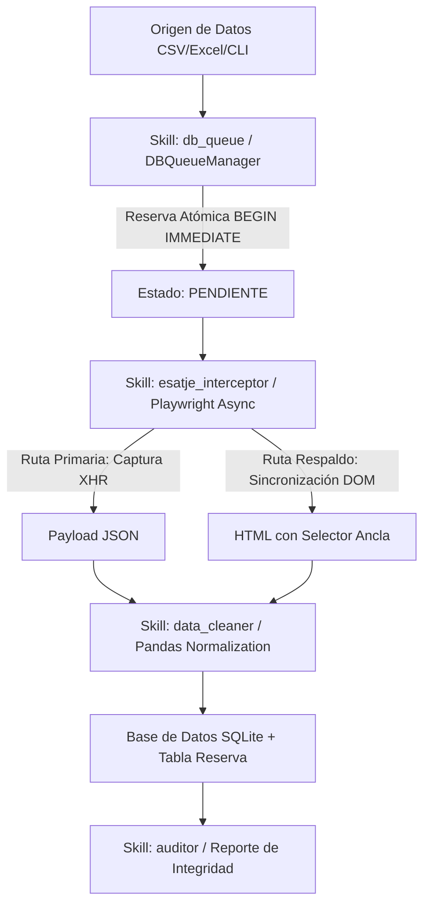

# Master Skill Repository — Antigravity Agentic Workflows

Este repositorio empaqueta habilidades deterministas (Skills) diseñadas para la arquitectura multi-agente de extracción procesal e-SATJE de la Función Judicial del Ecuador.

---

## 🛠️ Catálogo de Skills Incluidas

### 1. `esatje_interceptor`
- **Ubicación**: `skills/esatje_interceptor/`
- **Función**: Captura XHR/Fetch de respuestas JSON en tiempo real sin parseo del DOM.
- **Regla de Oro**: Prohibido el uso de `time.sleep()`. Uso estricto de eventos de red y locators.

### 2. `data_cleaner`
- **Ubicación**: `skills/data_cleaner/`
- **Función**: Estandarización de DataFrames de Pandas (cabeceras en UPPERCASE, sanitización de caracteres NFD y espacios).

### 3. `db_queue`
- **Ubicación**: `skills/db_queue/`
- **Función**: Administración transaccional SQLite con reservas atómicas en bloque `BEGIN IMMEDIATE`. Control de estados `PENDIENTE`, `EN_PROCESO`, `EXITO`, `ERROR`.

### 4. `auditor`
- **Ubicación**: `skills/auditor/`
- **Función**: Generación de reportes de integridad, porcentaje de salud del lote procesado y control de log de errores.

---

## 💻 CLI Ergonomics (`main.py`)

La herramienta provee una interfaz CLI moderna con `typer` y `rich`:

- `python main.py db-init`: Inicializa tablas DDL.
- `python main.py run <NUMERO_JUICIO>`: Ejecuta el pipeline para un único juicio.
- `python main.py batch <ARCHIVO>`: Procesamiento masivo por lotes con barra de progreso.
- `python main.py status`: Muestra el panel interactivo de transacciones.
- `python main.py retry`: Reinicia causas fallidas de vuelta a `PENDIENTE`.
- `python main.py audit`: Emite un diagnóstico de salud del sistema.
- `python main.py skills-list`: Lista las habilidades cargadas en la CLI.

---

## 📋 Checklist de Calidad Agéntica
- [x] Transacciones SQLite aisladas con rollback ante errores.
- [x] Estandarización de esquemas Pandas.
- [x] Zero esperas fijas (`time.sleep`).
- [x] CLI con feedback visual e interactivo.
